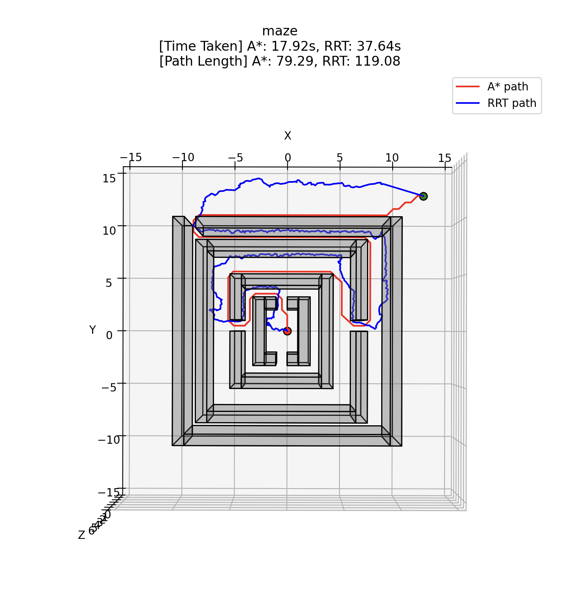

# 3D Motion Planning using A* and RRT Algorithms

**Girish Krishnan** | [GitHub](https://github.com/Girish-Krishnan) | [LinkedIn](https://www.linkedin.com/in/girk/)

This project explores **A*** and **RRT** algorithms for 3D motion planning, implemented for the graduate course **ECE 276B: Planning and Learning in Robotics** at UC San Diego. For code or report details, contact: gikrishnan@ucsd.edu.

---

## Overview

Motion planning determines a collision-free path for a robot in 3D space, essential for robotics and autonomous systems. This project compares:

- **A***: A search-based algorithm using heuristics to find the shortest path.
- **RRT**: A sampling-based algorithm building a tree by sampling points in the environment.

## Problem Formulation

1. **Configuration Space**: 
   - $\mathcal{C} \subset \mathbb{R}^3$: 3D space bounded by $[x_{min}, x_{max}], [y_{min}, y_{max}], [z_{min}, z_{max}]$.
   - $\mathcal{C}_{free} \subset \mathcal{C}$: Free space without obstacles.

2. **Start & Goal**: $x_s$ and $x_\tau$ in $\mathcal{C}_{free}$.

3. **Path**: Continuous function $\rho: [0, 1] \to \mathcal{C}_{free}$, minimizing cost $J(\rho)$.

4. **Objective**:
   $$\rho^* = \arg \min_{\rho \in \mathcal{P}_{s, \tau}} J(\rho), \text{ where } J(\rho) = \text{path length}.$$

## Technical Approach

### A* Algorithm

1. **Discretization**:
   - Define a 3D grid with resolution $g$.
   - Convert coordinates: $\mathbf{c} = \lfloor (\mathbf{x} - \mathbf{m}) / g \rfloor$.

2. **Graph Representation**:
   - Nodes: Grid cells in $\mathcal{S}_{free}$.
   - Edges: 26-connected neighbors, cost $c(s, s') = \|s - s'\|_2$.

3. **Heuristic**:
   - Euclidean distance: $h(s) = \|s - \mathbf{x}_\tau\|_2$.

4. **Algorithm**:
   - Expand nodes using $f(s) = g(s) + \epsilon \cdot h(s)$.
   - Collision check for each path segment.

### RRT Algorithm

1. **Sampling**: Randomly sample $\mathbf{x}_{rand} \in \mathcal{C}$.
2. **Nearest Neighbor**: Find $$\mathbf{x}_{near} = \arg \min_{\mathbf{x} \in T} \|\mathbf{x} - \mathbf{x}_{rand}\|$$.
3. **Steering**: Move toward $\mathbf{x}_{rand}$ by step $q$: $\mathbf{x}_{new} = \mathbf{x}_{near} + q \cdot \frac{\mathbf{x}_{rand} - \mathbf{x}_{near}}{\|\mathbf{x}_{rand} - \mathbf{x}_{near}\|}$.
4. **Collision Check**: Verify path to $\mathbf{x}_{new}$ is collision-free.
5. **Goal Bias**: With probability $p$, sample goal directly.

## Results

### Performance Comparison

| Map             | Algorithm | Path Length | Time (s) | Nodes/Samples |
|------------------|-----------|-------------|----------|---------------|
| Single Cube      | A*        | 7           | 0.0125   | 12            |
|                  | RRT       | 8           | 0.0089   | 73            |
| Maze             | A*        | 79          | 17.9174  | 8938          |
|                  | RRT       | 119         | 37.6400  | 84317         |
| Flappy Bird      | A*        | 25          | 4.0500   | 3456          |
|                  | RRT       | 37          | 0.5529   | 3031          |
| Monza            | A*        | 77          | 2.6216   | 3056          |
|                  | RRT       | 106         | 60.0000  | 309952        |

### Path Visualizations

#### Single Cube

|  |  |  |
|:-----------------------------------------:|:-----------------------------------------:|:-----------------------------------------:|

#### Maze

|  |  |
|:----------------------------------:|:----------------------------------:|

### Key Insights

- **Efficiency**: A* is faster in structured maps (e.g., maze) due to guided search. RRT is better in unstructured maps.
- **Path Quality**: A* paths are shorter and smoother, while RRT paths are noisier due to random sampling.

### RRT Trees

|  |  |  |
|:-----------------------------------:|:-----------------------------------:|:-----------------------------------:|

## Conclusion

A* guarantees optimal paths in discretized spaces but is computationally expensive. RRT efficiently explores high-dimensional spaces but may generate suboptimal paths. The choice depends on task requirements, such as optimality vs. exploration speed.
